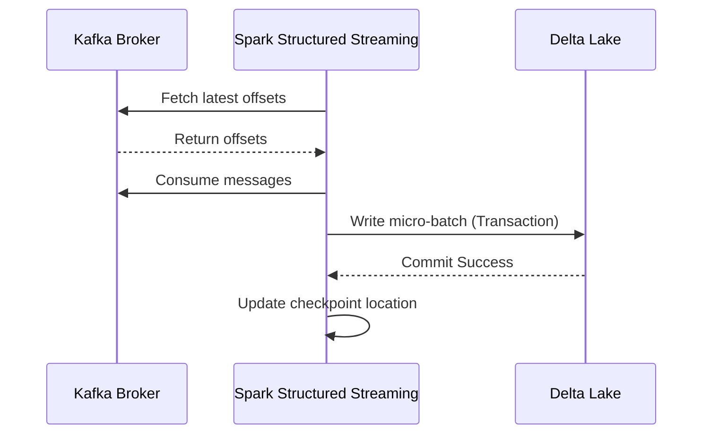

# Distributed Compute Integration Guide

## 1. Event Streaming Integration (Kafka to Flink/Spark)

### Architectural Context
Integrating distributed compute with log-based message brokers (Kafka/Pulsar) requires exact-once semantics (EOS). This is achieved via transactional producers and offset checkpointing coordinated by the compute engine's master node.

### Mathematical Thresholds
Consumer Lag calculation:
$$ Lag = \sum_{p \in Partitions} (Offset_{latest, p} - Offset_{committed, p}) $$
If $Lag > \lambda_{threshold}$, autoscale the compute executors.

### Implementation (PySpark)
Reading from Kafka with explicit offset management for exactly-once processing:
```python
from pyspark.sql import SparkSession

spark = SparkSession.builder.appName("KafkaIntegration").getOrCreate()

df = spark \
  .readStream \
  .format("kafka") \
  .option("kafka.bootstrap.servers", "broker1:9092,broker2:9092") \
  .option("subscribe", "telemetry_data") \
  .option("startingOffsets", "earliest") \
  .option("failOnDataLoss", "false") \
  .load()

# Transformation
processed_df = df.selectExpr("CAST(key AS STRING)", "CAST(value AS STRING)")

query = processed_df \
  .writeStream \
  .format("delta") \
  .outputMode("append") \
  .option("checkpointLocation", "/lake/checkpoints/telemetry") \
  .start("/lake/tables/telemetry")
```

### System Architecture

