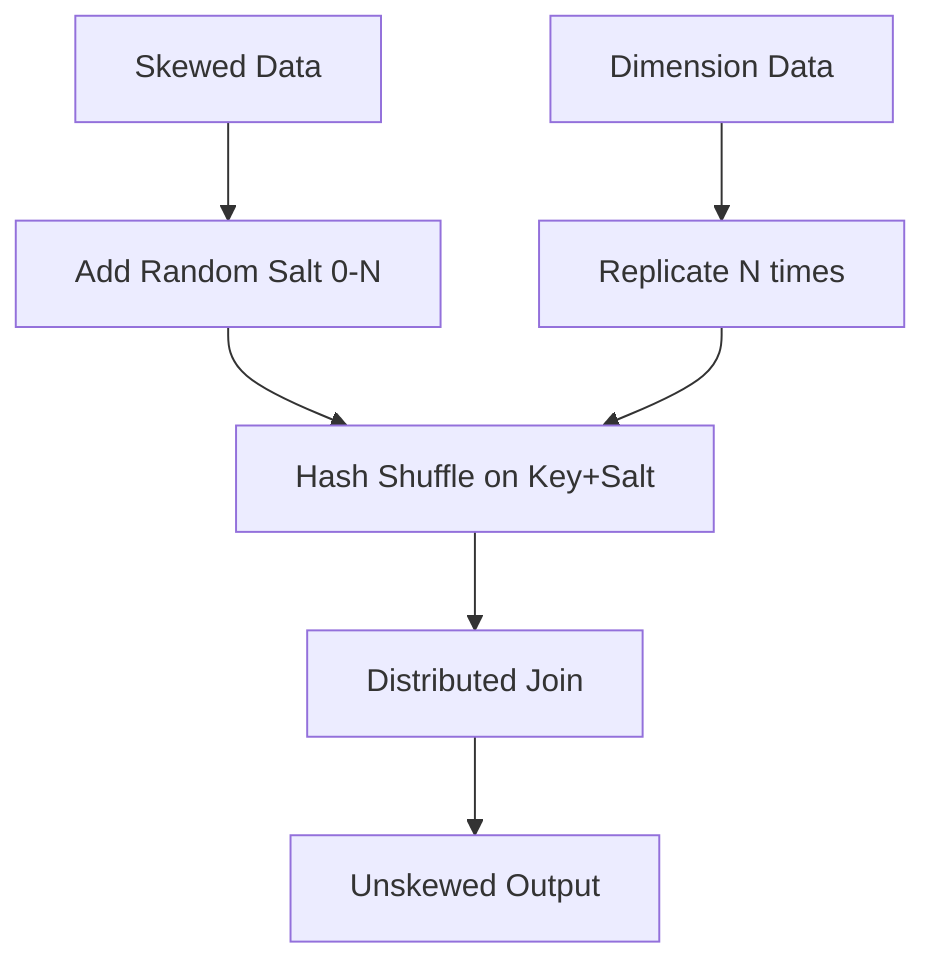

# Distributed Compute Performance Tuning

## 1. Data Skew & Shuffle Optimization

### Architectural Context
Data skew during distributed joins or aggregations causes straggler tasks, where one executor is processing an overwhelming majority of the data. Resolving this requires adaptive query execution, salting, or broadcast joins.

### Mathematical Thresholds
Broadcast Join threshold formula:
$$ S_{table} < \frac{M_{executor\_memory} \times F_{broadcast\_fraction}}{N_{nodes}} $$
If $S_{table}$ is under the broadcast threshold (e.g., 10MB in Spark), it avoids the expensive shuffle phase.

### Implementation (SQL & PySpark)
Salting technique to mitigate skew:
```python
from pyspark.sql.functions import col, rand, lit

# Add a random salt (0-9) to the skewed table
skewed_df_salted = skewed_df.withColumn("salt", (rand() * 10).cast("int"))
# Explode the small table to match the salt
small_df_exploded = small_df.crossJoin(spark.range(10).withColumnRenamed("id", "salt"))

# Perform the join on the key + salt
joined_df = skewed_df_salted.join(
    small_df_exploded,
    (skewed_df_salted.join_key == small_df_exploded.join_key) & 
    (skewed_df_salted.salt == small_df_exploded.salt)
).drop("salt")
```

### System Architecture

