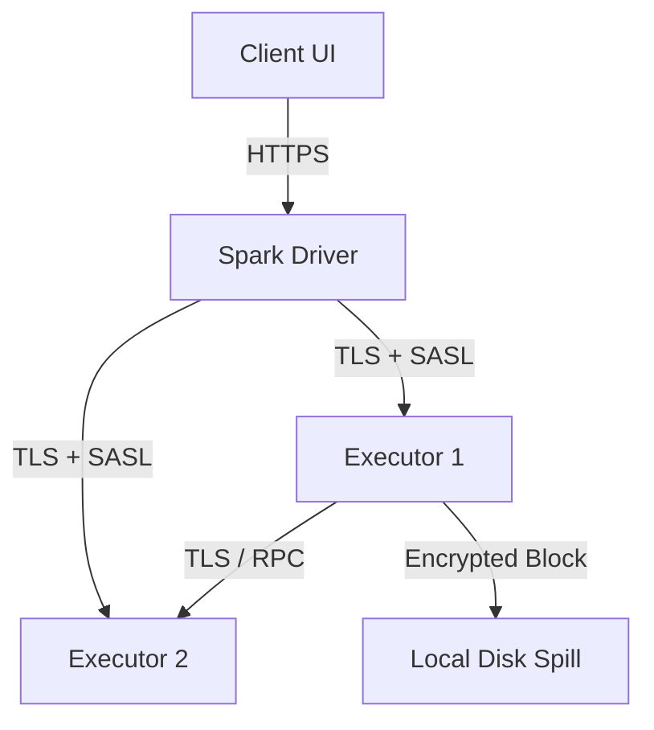

# Distributed Compute Security Best Practices

## 1. Network & Authentication Security

### Architectural Context
Securing a distributed compute cluster requires encrypting data in transit (TLS) between executors, encrypting spill files on disk, and enforcing strong authentication (Kerberos) for RPC calls.

### Mathematical Thresholds
Cryptographic overhead calculation for TLS over RPC:
$$ Overhead(\%) = \left( \frac{T_{encrypted} - T_{plaintext}}{T_{plaintext}} \right) \times 100 $$
Typically, AES-GCM hardware acceleration keeps this below 5% for modern CPUs.

### Implementation (Configuration)
Spark security configuration for network encryption and authentication:
```properties
spark.authenticate true
spark.authenticate.secret <secure_secret_key>
spark.network.crypto.enabled true
spark.network.crypto.saslFallback false
spark.io.encryption.enabled true
spark.io.encryption.keySizeBits 256
spark.ssl.enabled true
spark.ssl.keyStore /etc/security/keystores/server.keystore
```

### System Architecture

