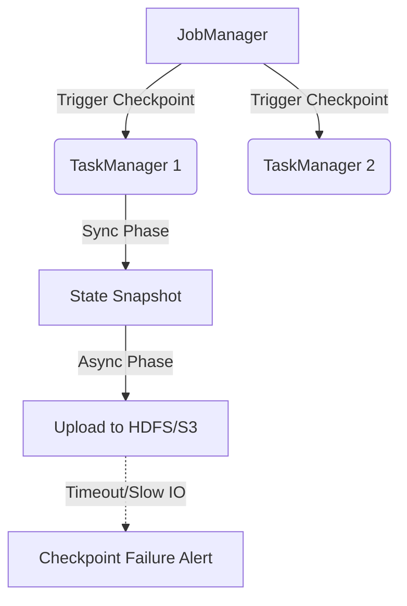

# Distributed Compute Troubleshooting Guide

## 1. OOM debugging and Checkpoint Failures

### Architectural Context
When Flink or Spark applications fail, the root cause is usually memory mismanagement (Out of Memory - OOM) or distributed checkpointing timeouts due to slow storage IO.

### Mathematical Thresholds
Checkpoint timeout criteria:
$$ T_{checkpoint\_duration} > T_{alignment} + T_{async\_snapshot} $$
If the duration exceeds the configured `checkpointTimeout`, the checkpoint is aborted.

### Implementation (Bash & Config)
Debugging OOMs in Flink requires analyzing heap dumps. Enable heap dumps on OOM in `flink-conf.yaml`:
```yaml
env.java.opts: "-XX:+HeapDumpOnOutOfMemoryError -XX:HeapDumpPath=/var/log/flink/heap_dumps/"
state.backend: rocksdb
state.backend.rocksdb.memory.managed: true
```
Analyze the heap dump using `jhat` or Eclipse MAT:
```bash
jhat -port 7401 /var/log/flink/heap_dumps/java_pid12345.hprof
```

### System Architecture

