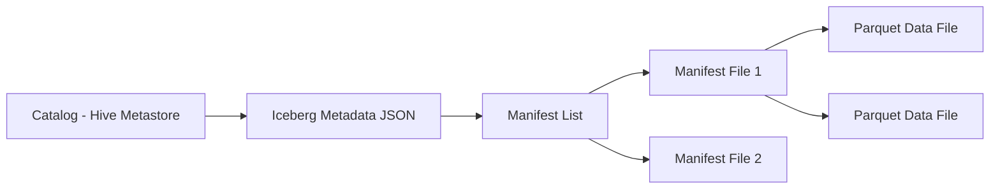

# Distributed Storage API Reference

## 1. Apache Iceberg Table API

### Architectural Context
Modern distributed storage relies on table formats like Apache Iceberg to provide ACID transactions over object stores (S3/GCS). The API manages snapshot isolation and hidden partitioning.

### Mathematical Thresholds
Metadata overhead limitation:
$$ O_{manifests} = N_{files} \times S_{entry\_size} $$
To keep planning time $T_{plan} < 100ms$, $O_{manifests}$ should be compacted regularly via metadata rewrite operations.

### Implementation (Java)
Using the Iceberg Java API to perform a schema evolution and partition spec update:
```java
import org.apache.iceberg.Table;
import org.apache.iceberg.catalog.TableIdentifier;
import org.apache.iceberg.hadoop.HadoopCatalog;

HadoopCatalog catalog = new HadoopCatalog(conf, "s3a://data-lake/warehouse");
Table table = catalog.loadTable(TableIdentifier.of("logs", "events"));

// Schema evolution
table.updateSchema()
    .addColumn("user_id", Types.LongType.get())
    .commit();

// Partition evolution (Hidden Partitioning)
table.updateSpec()
    .addField(Expressions.bucket("user_id", 16))
    .commit();
```

### System Architecture

