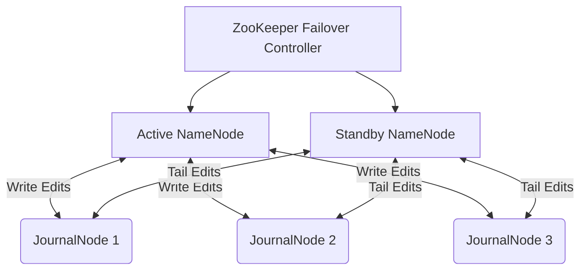

# Distributed Storage Architecture Patterns

## 1. HDFS NameNode High Availability (HA)

### Architectural Context
To eliminate the Single Point of Failure (SPOF) in HDFS, the HA architecture utilizes two or more NameNodes in an Active/Standby configuration, sharing state via a Quorum Journal Manager (QJM).

### Mathematical Thresholds
ZooKeeper Quorum requirement for automatic failover:
$$ N_{zk\_nodes} = 2f + 1 $$
Where $f$ is the number of tolerated node failures. For $f=1$, 3 ZooKeeper nodes are required.

### Implementation (Configuration)
`hdfs-site.xml` configuration for QJM:
```xml
<property>
  <name>dfs.namenode.shared.edits.dir</name>
  <value>qjournal://jn1:8485;jn2:8485;jn3:8485/mycluster</value>
</property>
<property>
  <name>dfs.client.failover.proxy.provider.mycluster</name>
  <value>org.apache.hadoop.hdfs.server.namenode.ha.ConfiguredFailoverProxyProvider</value>
</property>
```

### System Architecture

