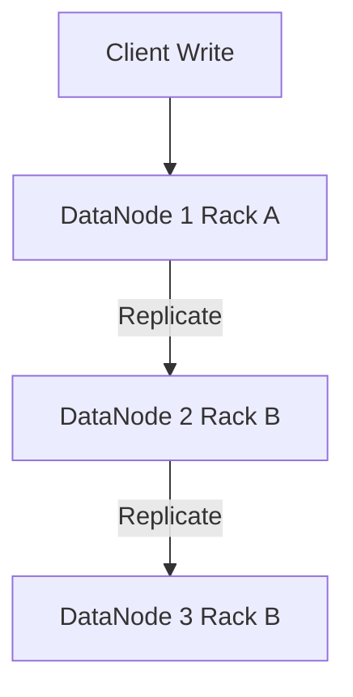

# Distributed Storage Configuration Guide

## 1. Block Size and Replication Strategy

### Architectural Context
Configuring HDFS or Object Store chunk sizes involves a trade-off between NameNode memory overhead and MapReduce/Spark task parallelism.

### Mathematical Thresholds
NameNode memory consumption:
$$ Mem_{NN} = (N_{files} + N_{blocks}) \times 150 \text{ bytes} $$
Optimum Block Size for Sequential Read Throughput:
$$ S_{block} = T_{seek\_time} \times \frac{V_{transfer\_rate}}{R_{seek\_ratio}} $$
Typically, 128MB or 256MB is chosen for HDFS to minimize seek time impact.

### Implementation (Configuration)
HDFS configurations in `hdfs-site.xml` for block size and topology-aware replication:
```xml
<property>
  <name>dfs.blocksize</name>
  <value>268435456</value> <!-- 256 MB -->
</property>
<property>
  <name>dfs.replication</name>
  <value>3</value>
</property>
<property>
  <name>net.topology.script.file.name</name>
  <value>/etc/hadoop/conf/rack-topology.sh</value>
</property>
```

### System Architecture

