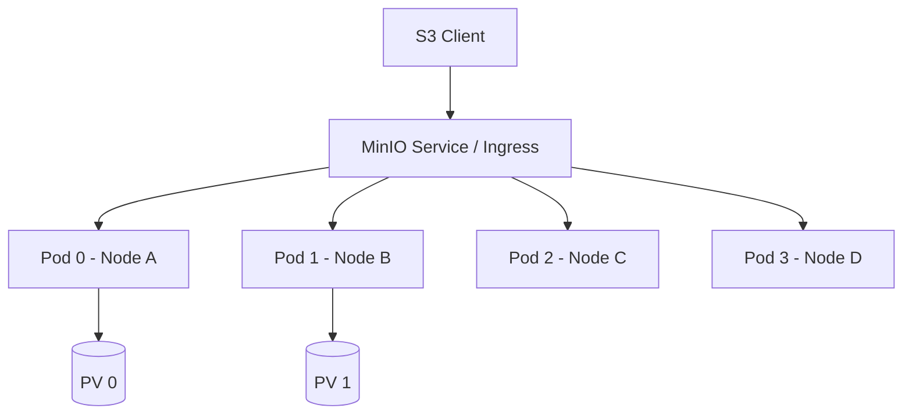

# Distributed Storage Deployment Strategies

## 1. MinIO on Kubernetes

### Architectural Context
Deploying an S3-compatible object store like MinIO on Kubernetes leverages Persistent Volumes (PVs) and StatefulSets to provide highly available, distributed block/object storage.

### Mathematical Thresholds
Erasure Coding parity calculation (e.g., 8 data drives, 4 parity drives):
$$ S_{usable} = \frac{N_{data}}{N_{data} + N_{parity}} \times S_{raw\_total} $$
For $EC:4$, usable capacity is 66%, but it can tolerate the loss of up to 4 drives.

### Implementation (YAML)
MinIO StatefulSet deployment snippet:
```yaml
apiVersion: apps/v1
kind: StatefulSet
metadata:
  name: minio
spec:
  serviceName: minio-headless
  replicas: 4
  selector:
    matchLabels:
      app: minio
  template:
    metadata:
      labels:
        app: minio
    spec:
      containers:
      - name: minio
        image: minio/minio:RELEASE.2023
        args:
        - server
        - http://minio-{0...3}.minio-headless.default.svc.cluster.local/data
        volumeMounts:
        - name: data
          mountPath: /data
  volumeClaimTemplates:
  - metadata:
      name: data
    spec:
      accessModes: [ "ReadWriteOnce" ]
      resources:
        requests:
          storage: 1Ti
```

### System Architecture

