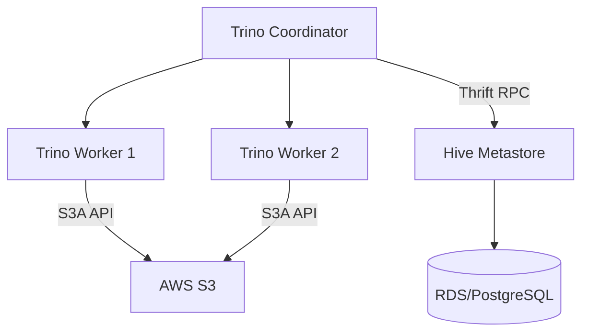

# Distributed Storage Integration Guide

## 1. Hive Metastore & Presto Integration

### Architectural Context
The Hive Metastore (HMS) acts as the central catalog for mapping table schemas to underlying distributed storage locations (HDFS/S3). Query engines like Presto/Trino use HMS to plan distributed scans.

### Mathematical Thresholds
Metastore Connection Pool limits (HikariCP):
$$ C_{max} = (N_{cores} \times 2) + N_{spindles} $$
For a database server with 8 cores, optimal max connections is typically around 20-30 to prevent thrashing on the underlying RDBMS.

### Implementation (Presto/Trino Config)
`hive.properties` configuration to connect Trino to HMS and S3 storage:
```properties
connector.name=hive-hadoop2
hive.metastore.uri=thrift://hms-server:9083
hive.s3.aws-access-key=${ENV:AWS_ACCESS_KEY}
hive.s3.aws-secret-key=${ENV:AWS_SECRET_KEY}
hive.s3.endpoint=https://s3.amazonaws.com
hive.metastore-cache-ttl=1h
hive.metastore-refresh-interval=5m
```

### System Architecture

