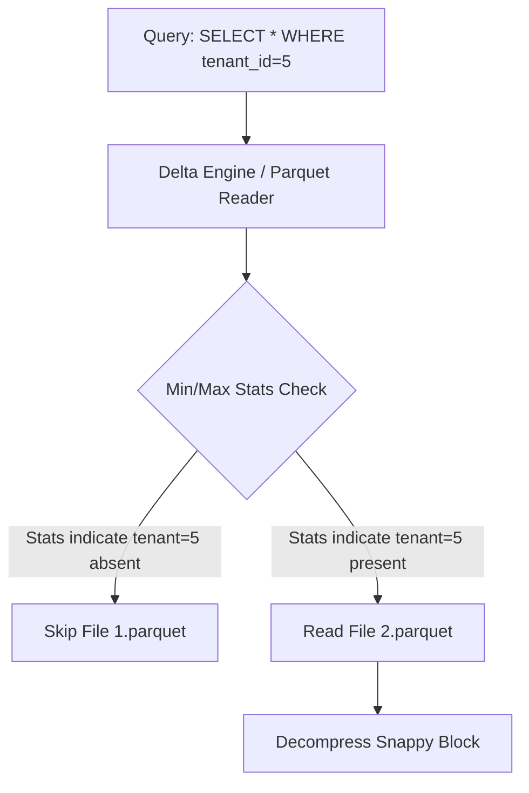

# Distributed Storage Performance Tuning

## 1. Parquet Compression & Z-Ordering

### Architectural Context
Columnar storage formats like Parquet offer pushdown predicates and projection pruning. Performance is highly dependent on compression algorithms (Snappy vs ZSTD) and the physical layout of the data on disk (Z-Ordering).

### Mathematical Thresholds
Z-Order curve effectiveness vs dimensionality:
$$ E_{zorder} = O\left( N^{1 - \frac{1}{d}} \right) $$
Where $d$ is the number of dimensions/columns Z-Ordered. Beyond $d=4$, the effectiveness of skipping data files drops significantly due to the "curse of dimensionality".

### Implementation (SQL)
Using Delta Lake (which builds on Parquet) to optimize data layout via Z-Ordering:
```sql
-- Optimize a large partitioned table by Z-Ordering on highly queried columns
OPTIMIZE events
WHERE date >= '2023-01-01'
ZORDER BY (tenant_id, event_type);

-- Analyze to compute column statistics for query planning
ANALYZE TABLE events COMPUTE STATISTICS FOR COLUMNS tenant_id, event_type;
```

### System Architecture

