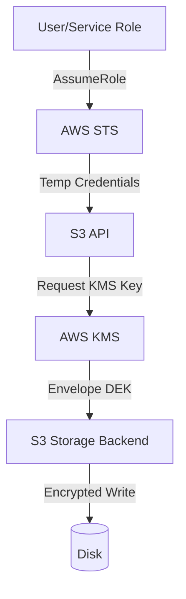

# Distributed Storage Security Best Practices

## 1. IAM, RBAC, and KMS Encryption

### Architectural Context
Securing a data lake requires fine-grained Role-Based Access Control (RBAC) often mediated by Apache Ranger, combined with At-Rest encryption using Key Management Service (KMS) envelope encryption.

### Mathematical Thresholds
Envelope Encryption Crypto-period rotation:
$$ R_{days} = \frac{T_{max\_bytes\_per\_key}}{V_{daily\_write\_rate}} $$
Assuming a DEK (Data Encryption Key) shouldn't encrypt more than $2^{32}$ blocks, rotation policies should be set accordingly (typically 90 days for the CMK).

### Implementation (Terraform)
AWS S3 Bucket policy enforcing KMS encryption and TLS transit:
```hcl
resource "aws_s3_bucket_policy" "secure_lake" {
  bucket = aws_s3_bucket.data_lake.id
  policy = jsonencode({
    Version = "2012-10-17"
    Statement = [
      {
        Sid       = "DenyUnencryptedObjectUploads"
        Effect    = "Deny"
        Principal = "*"
        Action    = "s3:PutObject"
        Resource  = "${aws_s3_bucket.data_lake.arn}/*"
        Condition = {
          StringNotEquals = {
            "s3:x-amz-server-side-encryption" = "aws:kms"
          }
        }
      },
      {
        Sid       = "DenyInsecureConnections"
        Effect    = "Deny"
        Principal = "*"
        Action    = "s3:*"
        Resource  = "${aws_s3_bucket.data_lake.arn}/*"
        Condition = {
          Bool = {
            "aws:SecureTransport" = "false"
          }
        }
      }
    ]
  })
}
```

### System Architecture

