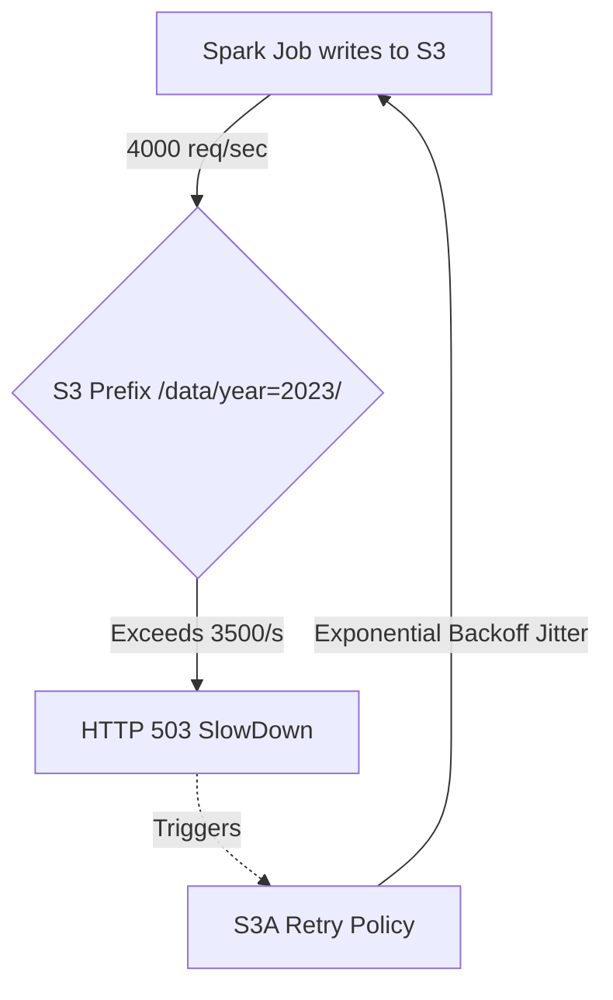

# Distributed Storage Troubleshooting Guide

## 1. HDFS Split-Brain and S3 Throttling

### Architectural Context
Distributed storage troubleshooting often involves resolving NameNode split-brain scenarios caused by ZooKeeper partitions, or diagnosing `SlowDown` (HTTP 503) errors from Cloud Object Stores due to request rate limits.

### Mathematical Thresholds
AWS S3 Request Rate Limits per prefix:
$$ Limit_{PUT} = 3500 \text{ req/sec} $$
$$ Limit_{GET} = 5500 \text{ req/sec} $$
If a Spark job writes to a single unpartitioned prefix with $N_{executors} \times N_{cores} > 3500$, `SlowDown` exceptions will occur.

### Implementation (Bash & Python)
Troubleshooting S3 Throttling by enabling exponential backoff in Spark `core-site.xml`:
```xml
<property>
  <name>fs.s3a.connection.maximum</name>
  <value>200</value>
</property>
<property>
  <name>fs.s3a.attempts.maximum</name>
  <value>20</value>
</property>
```
Analyzing HDFS Edit Logs for Split-Brain:
```bash
# Fetch and parse the edits log from the JournalNode
hdfs oev -p XML -i /dfs/jn/mycluster/current/edits_000000000000001 -o /tmp/edits.xml
# Search for active state transitions
grep -i "OP_START_LOG_SEGMENT" /tmp/edits.xml
```

### System Architecture

