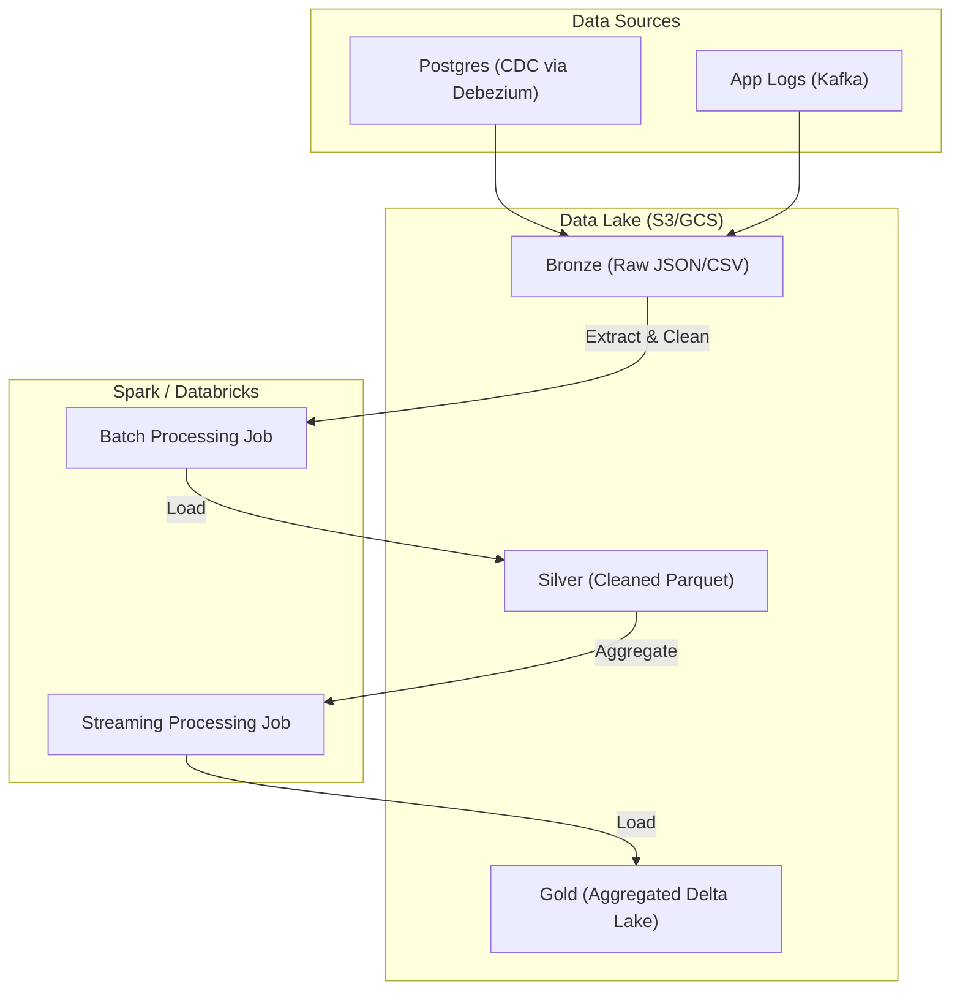

# Data Lake & Big Data Architecture

## Core Concepts

Modern data architectures separate compute from storage to process Petabytes of data affordably.

### 1. Data Lake vs Data Warehouse
- **Data Warehouse:** Structured data, Schema-on-Write (ETL). Expensive, fast queries (Snowflake, BigQuery).
- **Data Lake:** Raw, unstructured data, Schema-on-Read (ELT). Cheap storage in AWS S3/GCS using optimized columnar formats like Apache Parquet.

### 2. Lakehouse Architecture (Delta Lake / Apache Iceberg)
Combines the cheap storage of Data Lakes with the ACID transactions of Data Warehouses. It allows you to run `UPDATE` and `DELETE` commands directly on Parquet files in S3 by maintaining a transaction log.

### Data Pipeline Map

