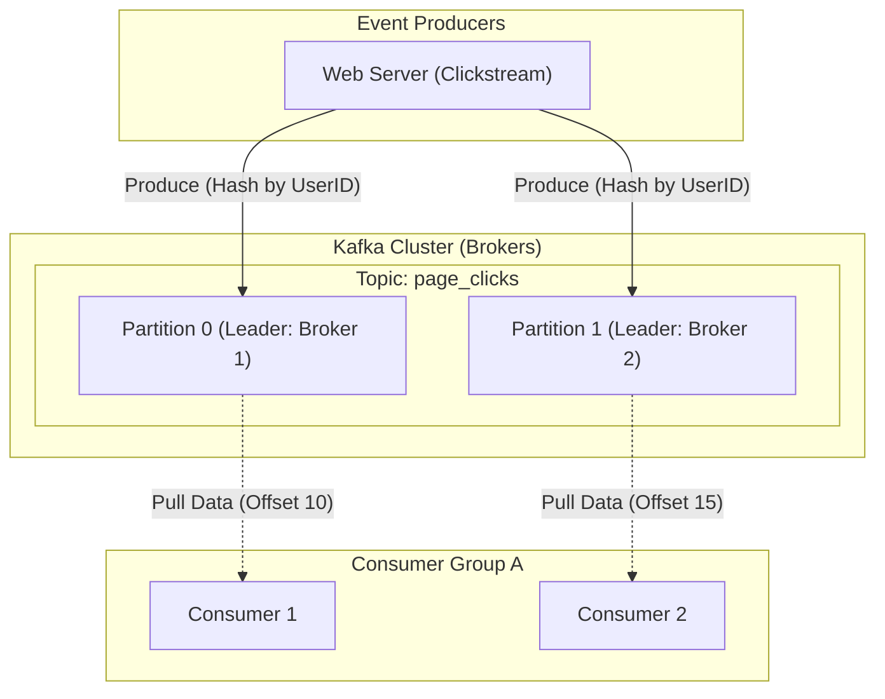

# Apache Kafka Event Streaming

## Core Concepts

Kafka is a distributed, high-throughput, append-only commit log used for event streaming.

### 1. Topics, Partitions, and Offsets
- **Topics:** Logical categories for messages.
- **Partitions:** Topics are split into Partitions for massive parallelism. Messages in a partition are strictly ordered.
- **Offsets:** A sequential ID assigned to each message. Consumers track their progress by saving their current offset.

### 2. Consumer Groups
A Consumer Group is a cluster of workers. Each partition in a topic is assigned to exactly ONE consumer within the group. If you have 4 partitions, adding a 5th consumer does nothing (it sits idle).

### Kafka Architecture Map

