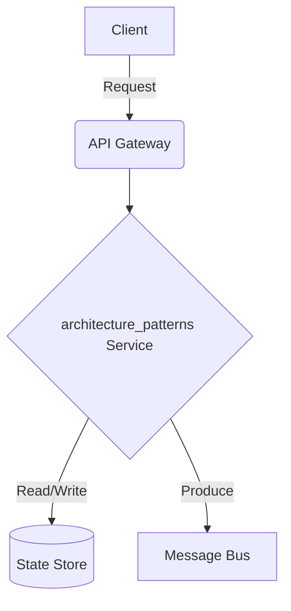

# Data ETL Pipeline - Architecture Patterns

## Deep Architectural Analysis
Analysis of Kappa and Lambda architectures. We evaluate event sourcing, CQRS, and micro-batching vs continuous processing.
This highly technical engineering wiki covers the data-etl-pipeline specific implementation details of architecture_patterns.

## Code Implementation
```python
class LambdaArchitecture:
    def serve(self, batch_view, speed_view):
        return merge(batch_view, speed_view)
```

## System Architecture Diagram


## Mathematical Formulas
Optimization calculation:
$$ Throughput T = \frac{N_{events}}{\Delta t} $$
