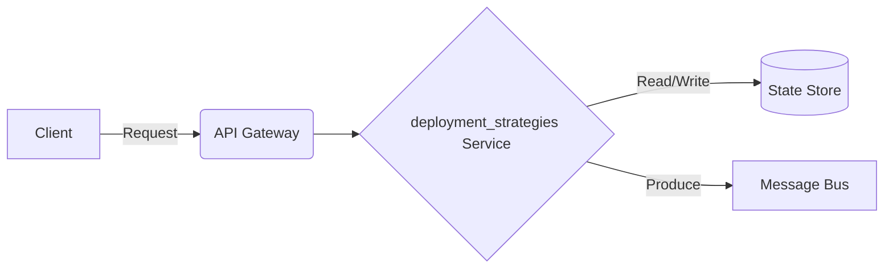

# Data ETL Pipeline - Deployment Strategies

## Deep Architectural Analysis
Blue-Green, Canary, and Shadow deployment patterns on Kubernetes using Helm and ArgoCD.
This highly technical engineering wiki covers the data-etl-pipeline specific implementation details of deployment_strategies.

## Code Implementation
```yaml
apiVersion: apps/v1
kind: Deployment
metadata:
  name: canary-app
```

## System Architecture Diagram


## Mathematical Formulas
Optimization calculation:
$$ Risk factor R = P(failure) \times Impact(failure) $$
