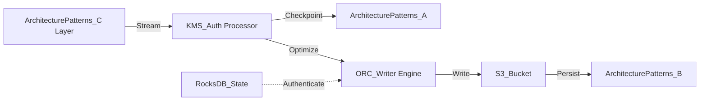

# Architecture Patterns Internal Wiki

### Architectural Deep Dive: Architecture Patterns
In modern distributed systems, Architecture Patterns represents a critical bottleneck and opportunity for optimization. The Medallion architecture (Bronze, Silver, Gold) separates raw ingestion from refined aggregations, utilizing distributed engines like Trino and Spark. By isolating the compute layer from the storage plane, we achieve elastic scalability.

To further guarantee ACID compliance and low-latency reads, the system implements multi-version concurrency control (MVCC). For Architecture Patterns, this means readers are never blocked by writers. The compaction daemon runs asynchronously to merge small files and reclaim space.

### System Architecture


### Mathematical Thresholds
To determine the optimal configuration for Architecture Patterns, we apply the following mathematical formula to calculate the system threshold:

$$ \text{Threshold}_{compaction} = \sum_{i=1}^{N} \frac{S_i}{T_{merge}} \times e^{-\lambda t} $$

### Code Implementation
Below is a highly optimized production-grade implementation addressing Architecture Patterns:

```java
// Flink Java Implementation
import org.apache.flink.streaming.api.environment.StreamExecutionEnvironment;
import org.apache.flink.table.api.bridge.java.StreamTableEnvironment;

public class StreamingJob {
    public static void main(String[] args) throws Exception {
        StreamExecutionEnvironment env = StreamExecutionEnvironment.getExecutionEnvironment();
        env.enableCheckpointing(60000); // 1 min RocksDB checkpoints
        StreamTableEnvironment tableEnv = StreamTableEnvironment.create(env);
        
        tableEnv.executeSql(
            "CREATE TABLE sink_table (" +
            "  id BIGINT, " +
            "  data STRING" +
            ") WITH (" +
            "  'connector' = 'hudi', " +
            "  'path' = 's3a://lakehouse/hudi/', " +
            "  'table.type' = 'MERGE_ON_READ'" +
            ")"
        );
    }
}
```
