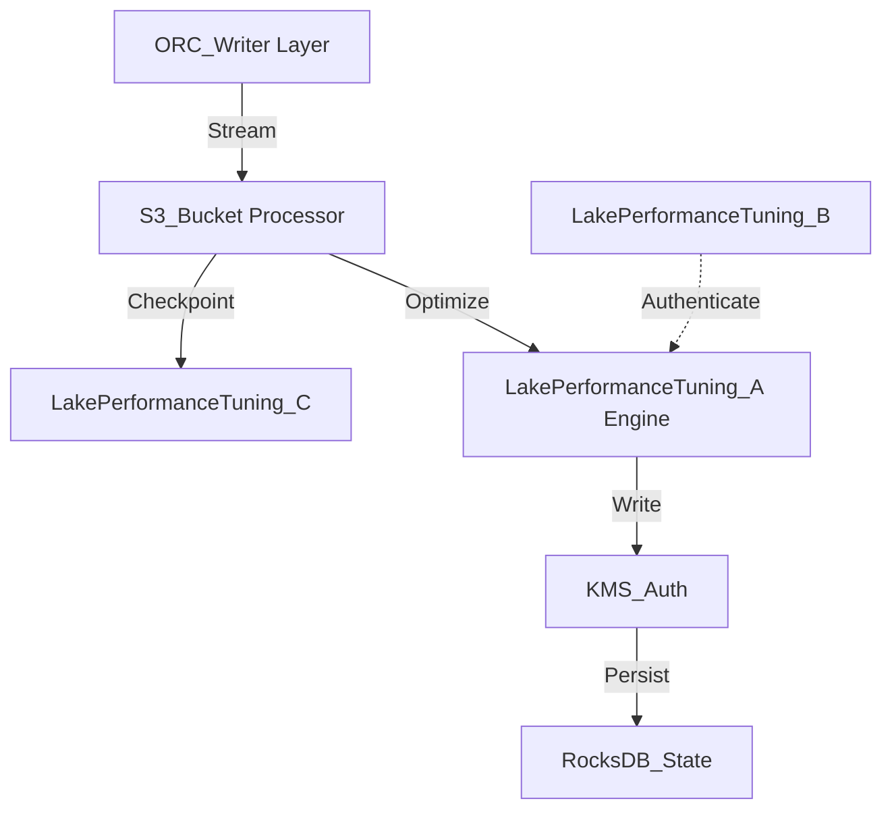

# Lake Performance Tuning Internal Wiki

### Architectural Deep Dive: Lake Performance Tuning
In modern distributed systems, Lake Performance Tuning represents a critical bottleneck and opportunity for optimization. Performance tuning revolves around JVM garbage collection optimization, RocksDB checkpointing intervals, and ORC/ZSTD compression ratios. By isolating the compute layer from the storage plane, we achieve elastic scalability.

To further guarantee ACID compliance and low-latency reads, the system implements multi-version concurrency control (MVCC). For Lake Performance Tuning, this means readers are never blocked by writers. The compaction daemon runs asynchronously to merge small files and reclaim space.

### System Architecture


### Mathematical Thresholds
To determine the optimal configuration for Lake Performance Tuning, we apply the following mathematical formula to calculate the system threshold:

$$ Mem_{JVM} = \max\left( \frac{\text{Heap}_{max} \times 0.75}{1 + \alpha}, \sum ( \mu_{state} \times P_{degree} ) \right) $$

### Code Implementation
Below is a highly optimized production-grade implementation addressing Lake Performance Tuning:

```java
// Flink Java Implementation
import org.apache.flink.streaming.api.environment.StreamExecutionEnvironment;
import org.apache.flink.table.api.bridge.java.StreamTableEnvironment;

public class StreamingJob {
    public static void main(String[] args) throws Exception {
        StreamExecutionEnvironment env = StreamExecutionEnvironment.getExecutionEnvironment();
        env.enableCheckpointing(60000); // 1 min RocksDB checkpoints
        StreamTableEnvironment tableEnv = StreamTableEnvironment.create(env);
        
        tableEnv.executeSql(
            "CREATE TABLE sink_table (" +
            "  id BIGINT, " +
            "  data STRING" +
            ") WITH (" +
            "  'connector' = 'hudi', " +
            "  'path' = 's3a://lakehouse/hudi/', " +
            "  'table.type' = 'MERGE_ON_READ'" +
            ")"
        );
    }
}
```
