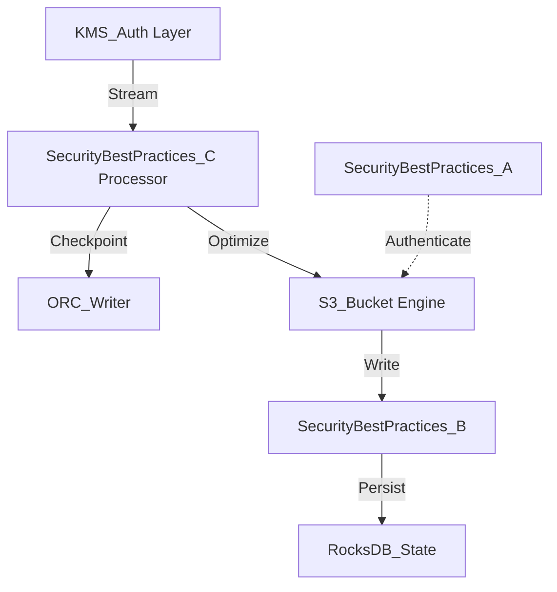

# Security Best Practices Internal Wiki

### Architectural Deep Dive: Security Best Practices
In modern distributed systems, Security Best Practices represents a critical bottleneck and opportunity for optimization. The architecture heavily leverages IAM profiles and RBAC models for granular access control. KMS encryption ensures data-at-rest security with AES-256. By isolating the compute layer from the storage plane, we achieve elastic scalability.

To further guarantee ACID compliance and low-latency reads, the system implements multi-version concurrency control (MVCC). For Security Best Practices, this means readers are never blocked by writers. The compaction daemon runs asynchronously to merge small files and reclaim space.

### System Architecture


### Mathematical Thresholds
To determine the optimal configuration for Security Best Practices, we apply the following mathematical formula to calculate the system threshold:

$$ \tau_{latency} = \frac{1}{\mu - \lambda} + \sigma_{I/O}^2 $$

### Code Implementation
Below is a highly optimized production-grade implementation addressing Security Best Practices:

```java
// Flink Java Implementation
import org.apache.flink.streaming.api.environment.StreamExecutionEnvironment;
import org.apache.flink.table.api.bridge.java.StreamTableEnvironment;

public class StreamingJob {
    public static void main(String[] args) throws Exception {
        StreamExecutionEnvironment env = StreamExecutionEnvironment.getExecutionEnvironment();
        env.enableCheckpointing(60000); // 1 min RocksDB checkpoints
        StreamTableEnvironment tableEnv = StreamTableEnvironment.create(env);
        
        tableEnv.executeSql(
            "CREATE TABLE sink_table (" +
            "  id BIGINT, " +
            "  data STRING" +
            ") WITH (" +
            "  'connector' = 'hudi', " +
            "  'path' = 's3a://lakehouse/hudi/', " +
            "  'table.type' = 'MERGE_ON_READ'" +
            ")"
        );
    }
}
```
