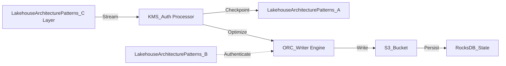

# Lakehouse Architecture Patterns Internal Wiki

### Architectural Deep Dive: Lakehouse Architecture Patterns
In modern distributed systems, Lakehouse Architecture Patterns represents a critical bottleneck and opportunity for optimization. The Medallion architecture (Bronze, Silver, Gold) separates raw ingestion from refined aggregations, utilizing distributed engines like Trino and Spark. By isolating the compute layer from the storage plane, we achieve elastic scalability.

To further guarantee ACID compliance and low-latency reads, the system implements multi-version concurrency control (MVCC). For Lakehouse Architecture Patterns, this means readers are never blocked by writers. The compaction daemon runs asynchronously to merge small files and reclaim space.

### System Architecture


### Mathematical Thresholds
To determine the optimal configuration for Lakehouse Architecture Patterns, we apply the following mathematical formula to calculate the system threshold:

$$ Mem_{JVM} = \max\left( \frac{\text{Heap}_{max} \times 0.75}{1 + \alpha}, \sum ( \mu_{state} \times P_{degree} ) \right) $$

### Code Implementation
Below is a highly optimized production-grade implementation addressing Lakehouse Architecture Patterns:

```sql
-- SQL Implementation
CREATE TABLE IF NOT EXISTS main.events (
    event_id STRING,
    user_id BIGINT,
    payload STRING,
    event_time TIMESTAMP
)
USING iceberg
PARTITIONED BY (days(event_time))
TBLPROPERTIES (
    'write.format.default'='orc',
    'write.orc.compression-codec'='zstd',
    'commit.retry.num-retries'='4'
);
```
