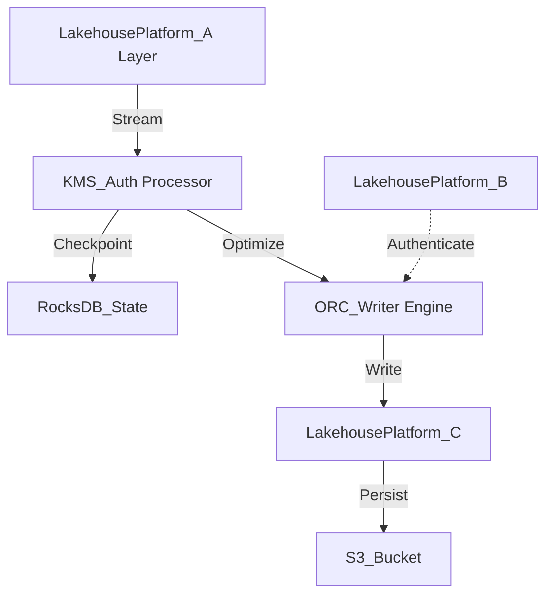

# Lakehouse Platform Internal Wiki

### Architectural Deep Dive: Lakehouse Platform
In modern distributed systems, Lakehouse Platform represents a critical bottleneck and opportunity for optimization. This deep dive into Lakehouse Platform reveals a sophisticated event-driven model using Kafka for WAL and Parquet for columnar persistence. By isolating the compute layer from the storage plane, we achieve elastic scalability.

To further guarantee ACID compliance and low-latency reads, the system implements multi-version concurrency control (MVCC). For Lakehouse Platform, this means readers are never blocked by writers. The compaction daemon runs asynchronously to merge small files and reclaim space.

### System Architecture


### Mathematical Thresholds
To determine the optimal configuration for Lakehouse Platform, we apply the following mathematical formula to calculate the system threshold:

$$ C_{opt} = \argmin_{C} \left( \alpha \cdot T_{CPU}(C) + \beta \cdot S_{Network}(C) \right) $$

### Code Implementation
Below is a highly optimized production-grade implementation addressing Lakehouse Platform:

```sql
-- SQL Implementation
CREATE TABLE IF NOT EXISTS main.events (
    event_id STRING,
    user_id BIGINT,
    payload STRING,
    event_time TIMESTAMP
)
USING iceberg
PARTITIONED BY (days(event_time))
TBLPROPERTIES (
    'write.format.default'='orc',
    'write.orc.compression-codec'='zstd',
    'commit.retry.num-retries'='4'
);
```
