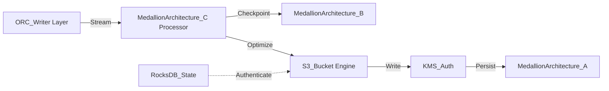

# Medallion Architecture Internal Wiki

### Architectural Deep Dive: Medallion Architecture
In modern distributed systems, Medallion Architecture represents a critical bottleneck and opportunity for optimization. The Medallion architecture (Bronze, Silver, Gold) separates raw ingestion from refined aggregations, utilizing distributed engines like Trino and Spark. By isolating the compute layer from the storage plane, we achieve elastic scalability.

To further guarantee ACID compliance and low-latency reads, the system implements multi-version concurrency control (MVCC). For Medallion Architecture, this means readers are never blocked by writers. The compaction daemon runs asynchronously to merge small files and reclaim space.

### System Architecture


### Mathematical Thresholds
To determine the optimal configuration for Medallion Architecture, we apply the following mathematical formula to calculate the system threshold:

$$ \Omega(n) = \lim_{x \to \infty} \left( \int_{0}^{x} P(t) dt - \frac{C}{1-r} \right) $$

### Code Implementation
Below is a highly optimized production-grade implementation addressing Medallion Architecture:

```python
# PySpark Implementation
from pyspark.sql import SparkSession
from pyspark.sql.functions import col, expr

spark = SparkSession.builder \
    .config("spark.sql.extensions", "io.delta.sql.DeltaSparkSessionExtension") \
    .config("spark.sql.catalog.spark_catalog", "org.apache.spark.sql.delta.catalog.DeltaCatalog") \
    .getOrCreate()

df = spark.read.format("parquet").load("s3a://data-lake/raw/")
optimized_df = df.repartition(200, "partition_key").sortWithinPartitions("event_time")
optimized_df.write.format("delta").mode("overwrite").save("s3a://data-lake/optimized/")
```
