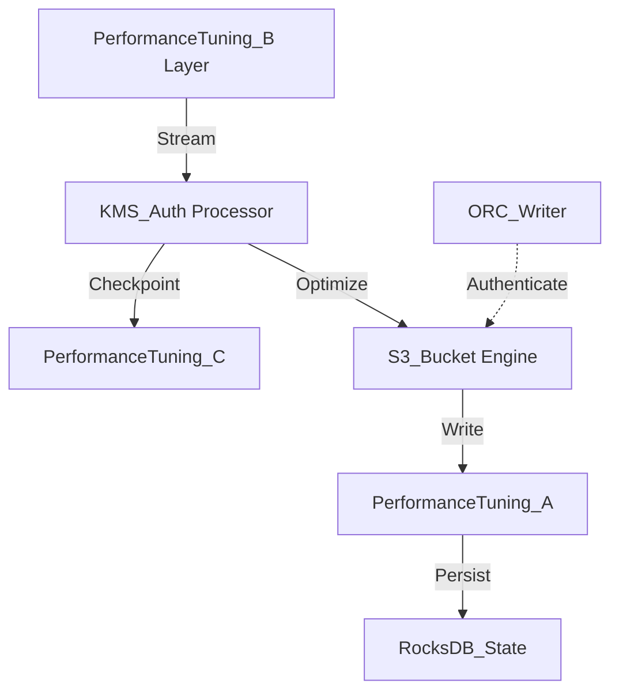

# Performance Tuning Internal Wiki

### Architectural Deep Dive: Performance Tuning
In modern distributed systems, Performance Tuning represents a critical bottleneck and opportunity for optimization. Performance tuning revolves around JVM garbage collection optimization, RocksDB checkpointing intervals, and ORC/ZSTD compression ratios. By isolating the compute layer from the storage plane, we achieve elastic scalability.

To further guarantee ACID compliance and low-latency reads, the system implements multi-version concurrency control (MVCC). For Performance Tuning, this means readers are never blocked by writers. The compaction daemon runs asynchronously to merge small files and reclaim space.

### System Architecture


### Mathematical Thresholds
To determine the optimal configuration for Performance Tuning, we apply the following mathematical formula to calculate the system threshold:

$$ C_{opt} = \argmin_{C} \left( \alpha \cdot T_{CPU}(C) + \beta \cdot S_{Network}(C) \right) $$

### Code Implementation
Below is a highly optimized production-grade implementation addressing Performance Tuning:

```scala
// Spark Scala implementation for RocksDB state backend
import org.apache.spark.sql.SparkSession
import org.apache.spark.sql.streaming.OutputMode

val spark = SparkSession.builder()
  .appName("StatefulApp")
  .config("spark.sql.streaming.stateStore.providerClass", "org.apache.spark.sql.execution.streaming.state.RocksDBStateStoreProvider")
  .getOrCreate()

val stream = spark.readStream.format("kafka").load()
stream.writeStream
  .format("console")
  .outputMode(OutputMode.Update())
  .start()
  .awaitTermination()
```
