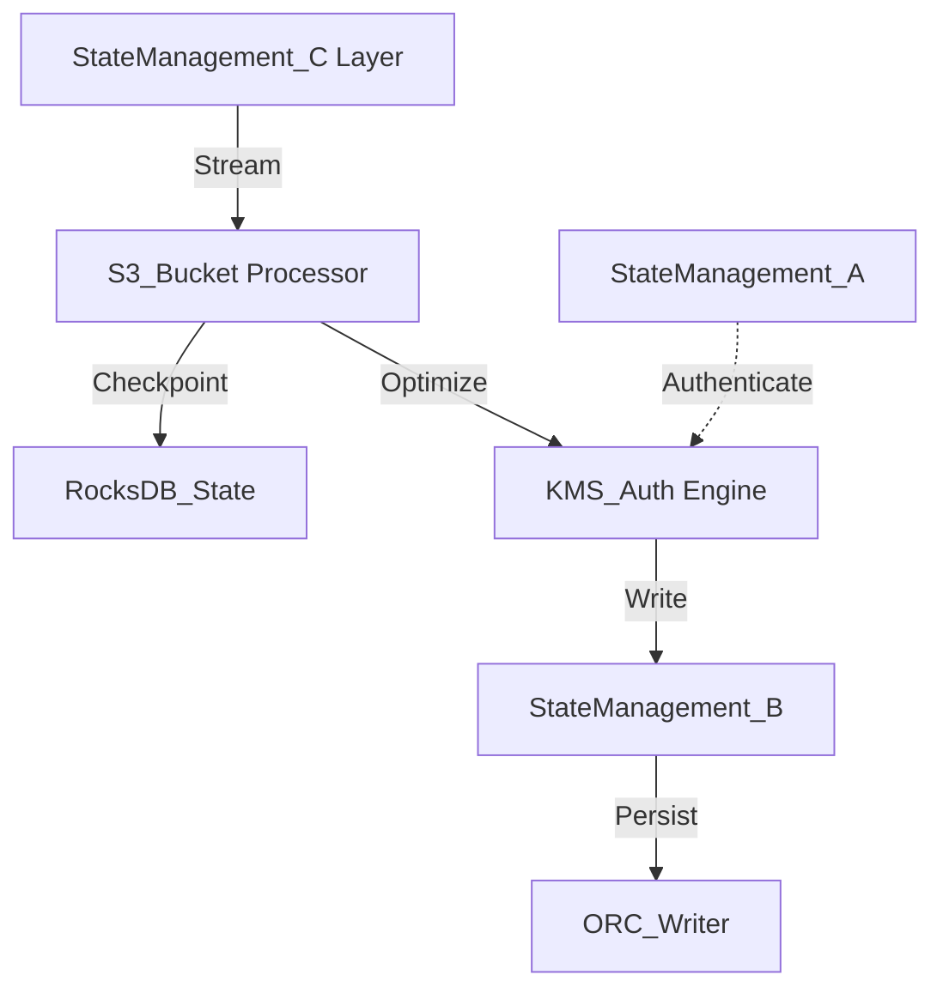

# State Management Internal Wiki

### Architectural Deep Dive: State Management
In modern distributed systems, State Management represents a critical bottleneck and opportunity for optimization. State management relies on asynchronous RocksDB snapshots, reducing checkpoint blocking time. Memory is bounded by strict heap limits. By isolating the compute layer from the storage plane, we achieve elastic scalability.

To further guarantee ACID compliance and low-latency reads, the system implements multi-version concurrency control (MVCC). For State Management, this means readers are never blocked by writers. The compaction daemon runs asynchronously to merge small files and reclaim space.

### System Architecture


### Mathematical Thresholds
To determine the optimal configuration for State Management, we apply the following mathematical formula to calculate the system threshold:

$$ Mem_{JVM} = \max\left( \frac{\text{Heap}_{max} \times 0.75}{1 + \alpha}, \sum ( \mu_{state} \times P_{degree} ) \right) $$

### Code Implementation
Below is a highly optimized production-grade implementation addressing State Management:

```python
# PySpark Implementation
from pyspark.sql import SparkSession
from pyspark.sql.functions import col, expr

spark = SparkSession.builder \
    .config("spark.sql.extensions", "io.delta.sql.DeltaSparkSessionExtension") \
    .config("spark.sql.catalog.spark_catalog", "org.apache.spark.sql.delta.catalog.DeltaCatalog") \
    .getOrCreate()

df = spark.read.format("parquet").load("s3a://data-lake/raw/")
optimized_df = df.repartition(200, "partition_key").sortWithinPartitions("event_time")
optimized_df.write.format("delta").mode("overwrite").save("s3a://data-lake/optimized/")
```
