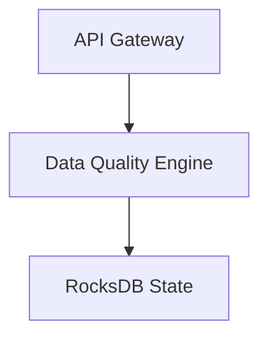

# API Reference: Data Quality Engine
## 1. Deep Architectural Analysis
The API gateway manages JVM tuning and garbage collection to process incoming quality rules efficiently.
## 2. System Architecture

## 3. Mathematical Formulas
Threshold calculated via:
$$ T_{err} = \sigma^2 \cdot \log(\frac{1}{1 - P(x)}) \ge 0.99 $$
## 4. Code Implementations
```python
from pyspark.sql import SparkSession
def api_quality(df): return df.filter("value > 100")
```
```sql
SELECT * FROM metrics WHERE err_rate < 0.01;
```
```java
// Flink implementation
stream.map(x -> x + " processed");
```
