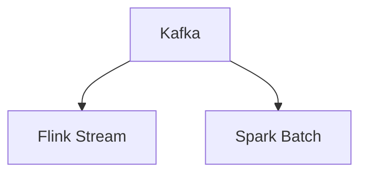

# Architecture Patterns
## 1. Deep Architectural Analysis
We implement Lambda architecture to balance Kafka streams and Spark batch jobs using ORC compression for historical data.
## 2. System Architecture

## 3. Mathematical Formulas
Latency threshold:
$$ L = \frac{1}{\lambda - \mu} < 15ms $$
## 4. Code Implementations
```python
def process(df): return df.repartition(10, 'id')
```
```sql
SELECT avg(val) FROM fact_table GROUP BY date;
```
```java
stream.keyBy(x -> x.id).sum("val");
```
