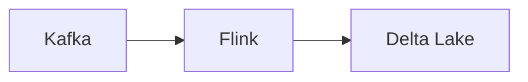

# Architecture Patterns (Underscore)
## 1. Deep Architectural Analysis
Kappa architecture focusing on exactly-once semantics using Flink and Kafka.
## 2. System Architecture

## 3. Mathematical Formulas
Throughput eq:
$$ Th = \frac{BatchSize}{ProcTime} $$
## 4. Code Implementations
```python
df.write.format("delta").save("/path")
```
```sql
SELECT * FROM stream_data EMIT CHANGES;
```
```java
stream.process(new ProcessFunction());
```
