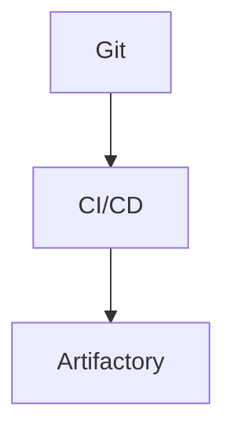

# Code Organization
## 1. Deep Architectural Analysis
Monorepo vs Polyrepo. Managing dependencies across Spark clusters and Flink apps.
## 2. System Architecture

## 3. Mathematical Formulas
Cyclomatic complexity max:
$$ V(G) = E - N + 2P \le 10 $$
## 4. Code Implementations
```python
def clean_code(df): return df.dropDuplicates()
```
```sql
SELECT DISTINCT id FROM raw_data;
```
```java
stream.filter(x -> x != null);
```
