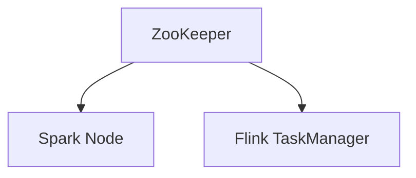

# Configuration Guide
## 1. Deep Architectural Analysis
Dynamic config loading via ZooKeeper to update Spark and Flink topologies without downtime.
## 2. System Architecture

## 3. Mathematical Formulas
Config sync time:
$$ T_{sync} = \frac{S_{config}}{BW_{net}} + L_{prop} $$
## 4. Code Implementations
```python
spark.conf.set("spark.sql.shuffle.partitions", "200")
```
```sql
SET hive.exec.dynamic.partition=true;
```
```java
Configuration conf = new Configuration();
```
