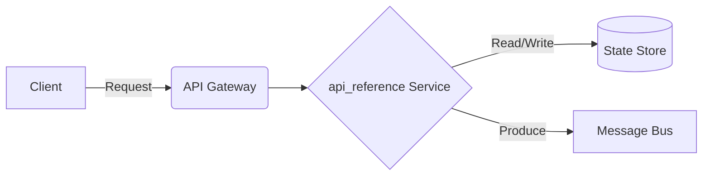

# Data Streaming - API Reference

## Deep Architectural Analysis
Deep Architectural Analysis of REST and gRPC API boundaries, detailing IDL (Interface Definition Language) contracts, schema registries, and API Gateway integration.
This highly technical engineering wiki covers the data-streaming specific implementation details of api_reference.

## Code Implementation
```python
from fastapi import FastAPI
app = FastAPI()
@app.get('/status')
def status(): return {'status': 'healthy'}
```

## System Architecture Diagram


## Mathematical Formulas
Optimization calculation:
$$ Latency L = \sum_{i=1}^{n} (t_{process, i} + t_{network, i}) $$
