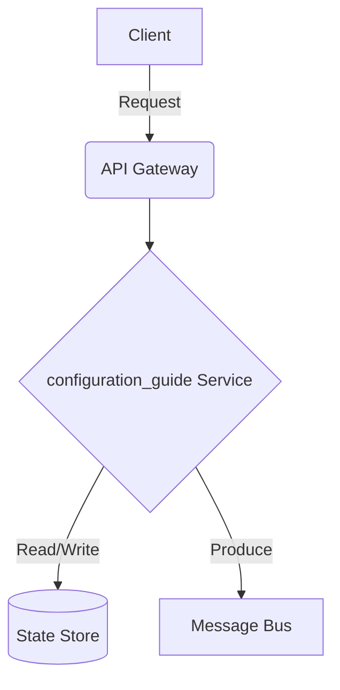

# Data Streaming - Configuration Guide

## Deep Architectural Analysis
Tuning YAML definitions, dynamic configuration via ZooKeeper/etcd, and JVM Heap allocations for optimal GC overhead.
This highly technical engineering wiki covers the data-streaming specific implementation details of configuration_guide.

## Code Implementation
```yaml
server:
  port: 8080
  jvm_args: '-Xmx4G -XX:+UseG1GC'
```

## System Architecture Diagram


## Mathematical Formulas
Optimization calculation:
$$ Heap Size H = M_{total} - (M_{os} + M_{offheap}) $$
