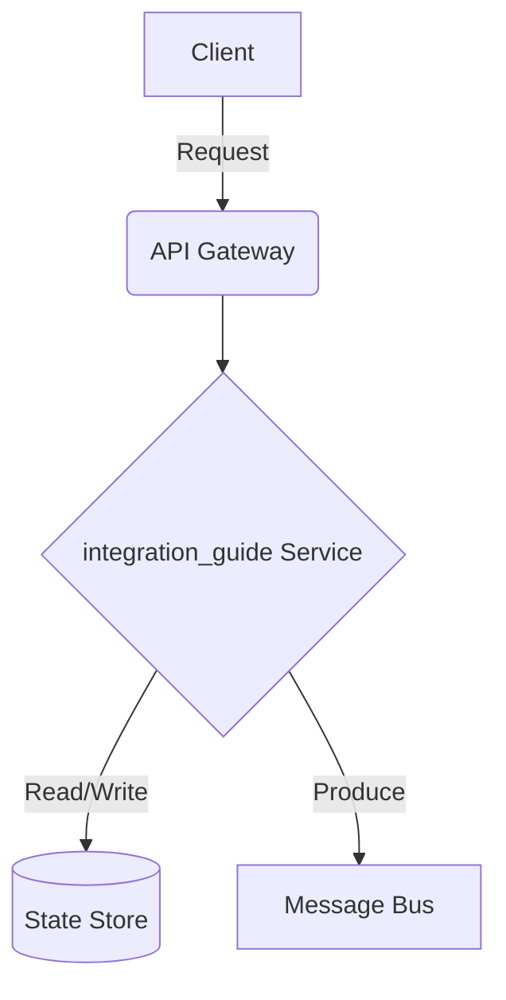

# Data Streaming - Integration Guide

## Deep Architectural Analysis
Integration with external systems like Salesforce, SAP, and legacy mainframes via Change Data Capture (CDC) and Debezium.
This highly technical engineering wiki covers the data-streaming specific implementation details of integration_guide.

## Code Implementation
```python
def setup_cdc(connector_config):
    requests.post('http://kafka-connect:8083/connectors', json=connector_config)
```

## System Architecture Diagram


## Mathematical Formulas
Optimization calculation:
$$ Data Drift D = \frac{|Schema_{new} \setminus Schema_{old}|}{|Schema_{old}|} $$
