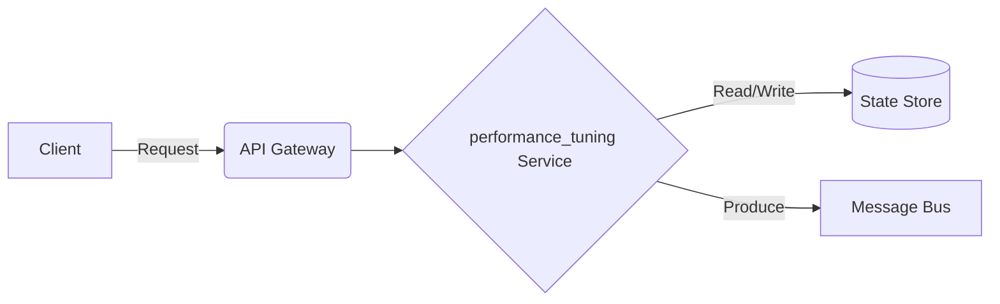

# Data Streaming - Performance Tuning

## Deep Architectural Analysis
JVM tuning, RocksDB state backend checkpointing, and ORC/Parquet compression algorithms (ZSTD, Snappy).
This highly technical engineering wiki covers the data-streaming specific implementation details of performance_tuning.

## Code Implementation
```python
spark.conf.set('spark.sql.parquet.compression.codec', 'zstd')
spark.conf.set('spark.sql.shuffle.partitions', '200')
```

## System Architecture Diagram


## Mathematical Formulas
Optimization calculation:
$$ Compression Ratio C_r = \frac{S_{uncompressed}}{S_{compressed}} $$
