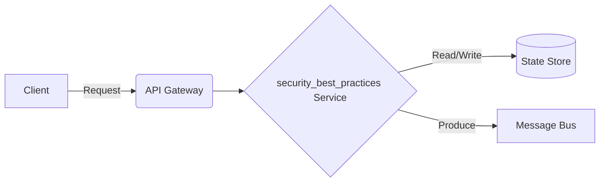

# Data Streaming - Security Best Practices

## Deep Architectural Analysis
IAM roles, RBAC, KMS encryption for data at rest, and mTLS for data in transit.
This highly technical engineering wiki covers the data-streaming specific implementation details of security_best_practices.

## Code Implementation
```python
def encrypt_payload(data, kms_key):
    cipher = AES.new(kms_key, AES.MODE_GCM)
    return cipher.encrypt(data)
```

## System Architecture Diagram


## Mathematical Formulas
Optimization calculation:
$$ Entropy E = - \sum p_i \log_2(p_i) $$
