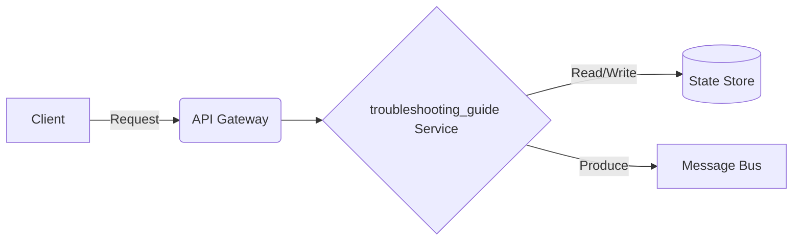

# Data Streaming - Troubleshooting Guide

## Deep Architectural Analysis
Debugging memory leaks, CPU spikes, and network partitions. Distributed tracing via OpenTelemetry and Jaeger.
This highly technical engineering wiki covers the data-streaming specific implementation details of troubleshooting_guide.

## Code Implementation
```python
def trace_execution():
    with tracer.start_as_current_span('process_batch') as span:
        span.set_attribute('batch_size', 500)
```

## System Architecture Diagram


## Mathematical Formulas
Optimization calculation:
$$ MTTR = \frac{\sum t_{downtime}}{\text{Number of Incidents}} $$
