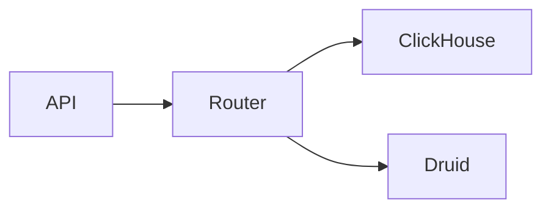

# API Reference DW
## 1. Deep Architectural Analysis
API handles complex OLAP queries routing them to ClickHouse or Druid based on payload.
## 2. System Architecture

## 3. Mathematical Formulas
Query routing cost:
$$ C = w_1 \cdot CPU + w_2 \cdot IO $$
## 4. Code Implementations
```python
df.write.format("jdbc").save()
```
```sql
SELECT count(1) FROM clickhouse_table;
```
```java
client.execute("SELECT 1");
```
