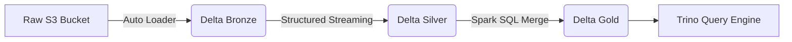

# Warehouse Architecture Patterns
## 1. Deep Architectural Analysis
The Lakehouse architecture bridges data lakes and warehouses. Utilizing Delta Lake with Z-Ordering on object storage enables efficient multi-dimensional clustering. This fundamentally transforms read-heavy OLAP workloads into optimized seek operations, bypassing the traditional MPP bottlenecks.

## 2. System Architecture


## 3. Mathematical Formulas
Z-Ordering efficiency clustering:
$$ E_{skip} = 1 - \frac{\sum_{i=1}^{n} (Max_i - Min_i)}{TotalRange} \ge 0.85 $$
Where skipping efficiency must exceed 85% to justify the Z-Order rewrite cost.

## 4. Code Implementations

### PySpark
```python
def optimize_table(spark, table_name):
    spark.sql(f"OPTIMIZE {table_name} ZORDER BY (tenant_id, event_time)")
```

### SQL
```sql
CREATE TABLE gold_metrics
USING DELTA
TBLPROPERTIES (delta.autoOptimize.optimizeWrite = true)
AS SELECT * FROM silver_metrics;
```

### Java (Flink)
```java
stream.sinkTo(
    DeltaSink.forRowData(new Path("s3a://gold/"))
    .build()
);
```
