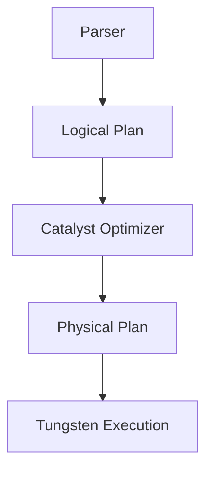

# Performance Optimization & Tuning
## 1. Deep Architectural Analysis
Cost-based Optimizers (CBO) and Vectorized Query Execution (e.g., Apache Arrow in memory) radically alter query performance. CPU cache locality (L1/L2) dominates performance when scanning columnar formats like Parquet, dictating the optimal row-group size.

## 2. System Architecture


## 3. Mathematical Formulas
Memory bandwidth saturation for vectorized reads:
$$ B = \frac{R \times C \times S}{T} \approx \min(B_{RAM}, B_{L3}) $$
$R$ = Rows, $C$ = Columns, $S$ = Size per cell.

## 4. Code Implementations

### PySpark
```python
def tune_spark(spark):
    spark.conf.set("spark.sql.adaptive.enabled", "true")
    spark.conf.set("spark.sql.adaptive.skewJoin.enabled", "true")
    return spark
```

### SQL
```sql
ANALYZE TABLE sales COMPUTE STATISTICS FOR COLUMNS customer_id, region;
```

### Java (Flink)
```java
env.getConfig().enableObjectReuse();
env.setParallelism(128);
env.getCheckpointConfig().setCheckpointInterval(60000);
```
