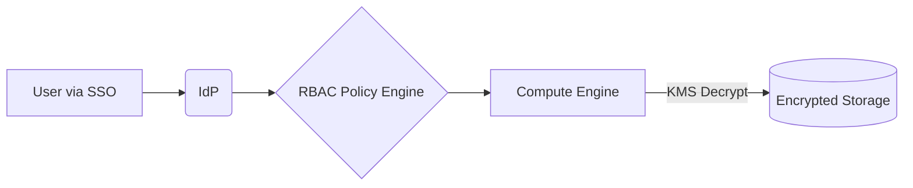

# Data Warehouse Security & Governance
## 1. Deep Architectural Analysis
Zero-trust architecture in DW involves IAM assumed roles for compute clusters, KMS Envelope Encryption for resting data, and Dynamic Data Masking (DDM) for PII. RBAC models must be federated via SSO (e.g., Okta via SAML 2.0).

## 2. System Architecture


## 3. Mathematical Formulas
Entropy of encryption key generation:
$$ H(K) = - \sum p(k) \log_2 p(k) \ge 256 \text{ bits} $$
Ensuring AES-256 GCM compliance.

## 4. Code Implementations

### PySpark
```python
def decrypt_df(df, key):
    from pyspark.sql.functions import expr
    return df.withColumn("ssn", expr(f"aes_decrypt(unbase64(ssn_enc), '{key}')"))
```

### SQL
```sql
CREATE MASKING POLICY ssn_mask AS (val string) RETURNS string ->
  CASE 
    WHEN current_role() IN ('HR', 'ADMIN') THEN val
    ELSE '***-**-****'
  END;
```

### Java
```java
// AWS KMS decryption
DecryptRequest request = new DecryptRequest().withCiphertextBlob(buffer);
DecryptResult result = kmsClient.decrypt(request);
```
