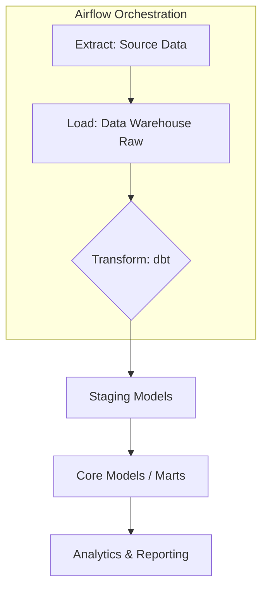

# ETL Pipelines (Airflow & dbt)

## Architecture Overview



## Best Practices
- **Airflow**: Keep DAGs simple. Offload heavy computation to the execution environment (e.g., Snowflake, BigQuery). Use `TaskGroups` for logical grouping.
- **dbt**: Modularize models into `staging`, `intermediate`, and `marts`. Write rigorous tests for uniqueness and not-null constraints.

## Code Snippet: Airflow DAG calling dbt
```python
from airflow import DAG
from airflow.providers.dbt.cloud.operators.dbt import DbtCloudRunJobOperator
from datetime import datetime

with DAG('dbt_daily_run', start_date=datetime(2023, 1, 1), schedule_interval='@daily') as dag:
    run_dbt_job = DbtCloudRunJobOperator(
        task_id='run_dbt_models',
        dbt_cloud_conn_id='dbt_default',
        job_id=12345
    )
```
