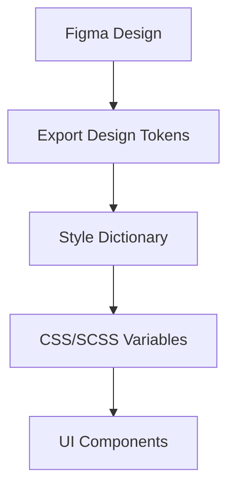

# Design Systems

## Core Principles
- **Consistency**: Reusable components and tokens across the UI.
- **Single Source of Truth**: Design tokens sync Figma and Codebase.

## Figma to Code Workflow


## Template: Design Token
```json
{
  "color": {
    "primary": {
      "value": "#0052cc",
      "type": "color"
    },
    "text": {
      "value": "#172b4d",
      "type": "color"
    }
  }
}
```
