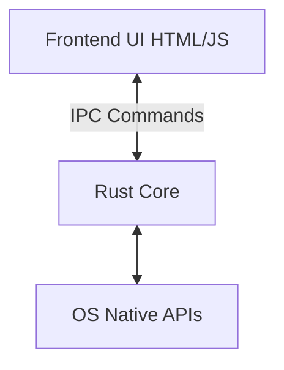

# Tauri Desktop Development

Use Tauri to build secure, cross-platform desktop applications.

## Secure Native IPC
Always use Tauri's command system for IPC to ensure security. Avoid enabling arbitrary eval or unsafe shell execution.

```rust
// src-tauri/src/main.rs
#[tauri::command]
fn secure_action(payload: String) -> Result<String, String> {
    // Validate payload and perform action securely
    if payload.is_empty() {
        return Err("Payload cannot be empty".into());
    }
    Ok(format!("Processed: {}", payload))
}

fn main() {
    tauri::Builder::default()
        .invoke_handler(tauri::generate_handler![secure_action])
        .run(tauri::generate_context!())
        .expect("error while running tauri application");
}
```

```javascript
// Frontend (JS/TS)
import { invoke } from '@tauri-apps/api/tauri'

async function triggerAction() {
    try {
        const response = await invoke('secure_action', { payload: 'data' });
        console.log(response);
    } catch (error) {
        console.error("IPC Error:", error);
    }
}
```

## Architecture

