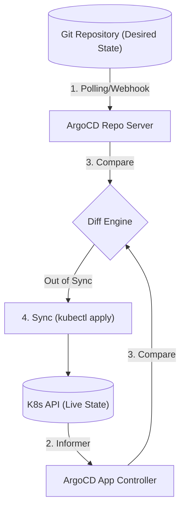

# ArgoCD: Architecture and Sync Phases

## 1. Push vs. Pull Architectures
Traditional CI/CD pipelines (like Jenkins or GitLab CI) use a **Push** architecture. The CI server builds the container, authenticates with the Kubernetes API, and pushes the `Deployment` manifests.
- **Security Flaw**: The CI server must store highly privileged Kubernetes credentials (kubeconfig). If the CI server is breached, the entire cluster is compromised.

**ArgoCD** uses a **Pull** (GitOps) architecture.
- ArgoCD runs *inside* the Kubernetes cluster.
- It pulls manifests from the Git repository.
- **Security Win**: The cluster pulls its own state. The CI server only needs to push a new image tag to Git. No cluster credentials ever leave the cluster.

## 2. The ArgoCD Reconciliation Loop
ArgoCD continuously monitors the Git repository and the live cluster state.



## 3. Sync Phases and Hooks
When deploying complex applications, you often need tasks to run before or after the deployment (e.g., database migrations). ArgoCD provides **Resource Hooks**.

By adding the annotation `argocd.argoproj.io/hook`, you can control execution order:
- **PreSync**: Runs before any manifests are applied. Perfect for database migrations (e.g., Flyway/Liquibase jobs). If the migration fails, the sync aborts, protecting the app.
- **Sync**: The main application deployment.
- **PostSync**: Runs after all resources are healthy. Useful for integration tests or Slack notifications.
- **SyncFail**: Runs if the sync operation fails. Useful for triggering automated rollbacks or PagerDuty alerts.

## 4. Scaling with ApplicationSets
Managing 50 microservices across 3 clusters (Dev, Staging, Prod) means managing 150 ArgoCD `Application` manifests.
**ApplicationSets** automate this using generators.

```yaml
apiVersion: argoproj.io/v1alpha1
kind: ApplicationSet
metadata:
  name: cluster-addons
spec:
  generators:
  - list:
      elements:
      - cluster: dev-cluster
        url: https://10.0.0.1
      - cluster: prod-cluster
        url: https://10.0.0.2
  template:
    metadata:
      name: '{{cluster}}-ingress-nginx'
    spec:
      project: default
      source:
        repoURL: https://github.com/my-org/infra.git
        targetRevision: HEAD
        path: addons/ingress-nginx
      destination:
        server: '{{url}}'
        namespace: ingress-nginx
```
This single file dynamically generates multiple `Application` objects based on the cluster list.
