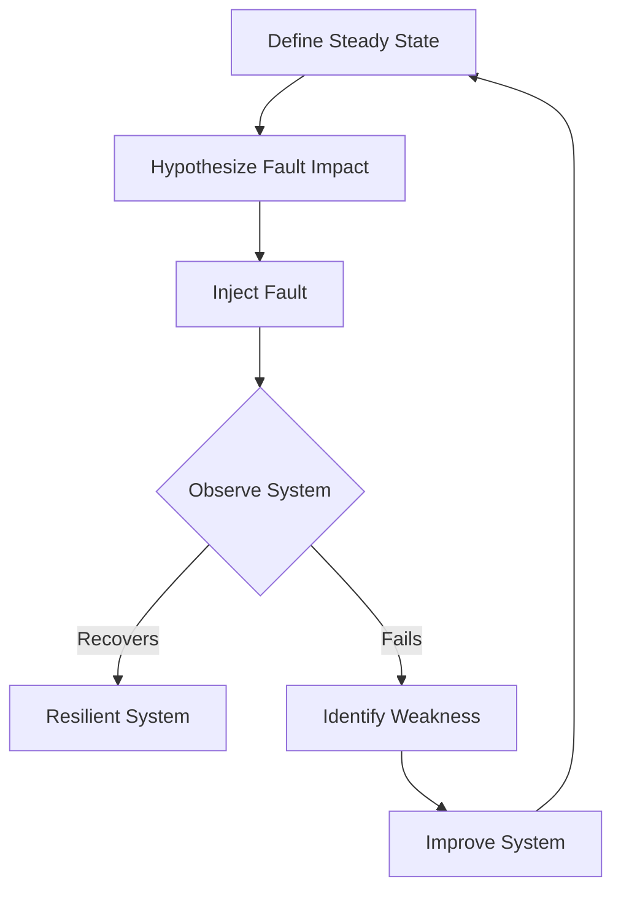

# Chaos Engineering

Automated fault injection and resilience testing to ensure system reliability.

## Fault Injection Snippet (YAML)
```yaml
apiVersion: chaos-mesh.org/v1alpha1
kind: NetworkChaos
metadata:
  name: network-delay
  namespace: default
spec:
  action: delay
  mode: one
  selector:
    labelSelectors:
      app: my-app
  delay:
    latency: "500ms"
    correlation: "100"
    jitter: "0ms"
  duration: "30s"
```

## Resilience Test Pipeline (Bash)
```bash
#!/bin/bash
echo "Applying NetworkChaos..."
kubectl apply -f network-delay.yaml

echo "Running health checks..."
for i in {1..5}; do
    curl -s --max-time 1 http://my-app.default.svc.cluster.local/health || echo "Health check failed"
    sleep 5
done

echo "Cleaning up..."
kubectl delete -f network-delay.yaml
```

## Chaos Workflow

