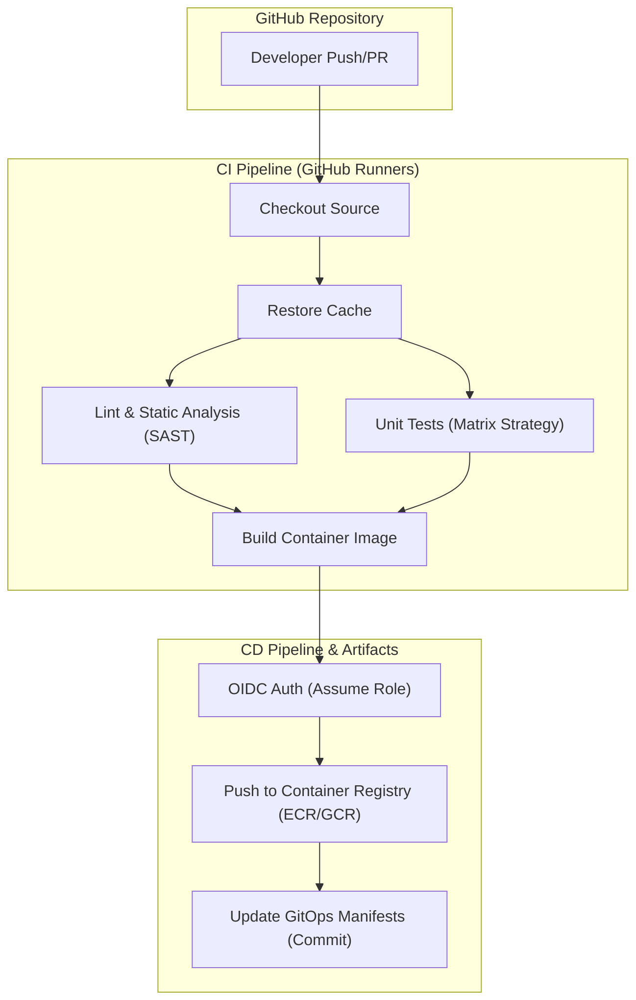

# GitHub Actions CI/CD Architecture

## Core Concepts

GitHub Actions provides native CI/CD. For enterprise systems, pipelines must be modular (Reusable Workflows), optimized (Caching), and secure (OIDC).

### 1. Matrix Builds & Caching
- **Matrix Builds:** Run tests simultaneously across multiple OS/Node versions to save pipeline time.
- **Caching:** Cache dependencies (`npm`, `pip`, Docker layers) to drastically reduce build times. Cache keys must be deterministic (e.g., hash of lockfiles).

### 2. OIDC (OpenID Connect) vs Secrets
Avoid storing long-lived AWS/GCP static credentials in GitHub. Use OIDC to establish trust between GitHub and the Cloud Provider, requesting temporary, short-lived STS tokens.

### Pipeline Architecture Map

