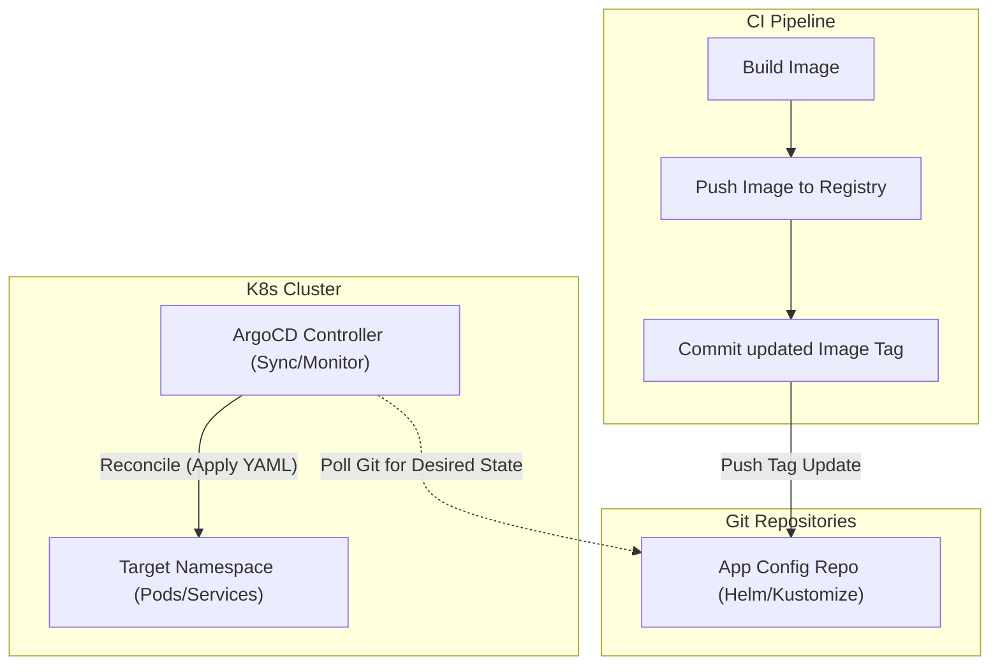

# GitOps with ArgoCD

## Core Concepts

GitOps shifts the paradigm from "Push" (CI server executes deployment commands) to "Pull" (an Agent inside the cluster monitors Git and pulls changes).

### 1. The Pull Model
ArgoCD runs inside Kubernetes. It continuously monitors a target Git repository containing the Desired State (YAML/Helm/Kustomize). If the cluster's Actual State diverges, ArgoCD automatically reconciles it.

### 2. Security Advantage
The CI pipeline no longer needs cluster admin credentials. It only needs permission to commit a new image tag to the config repository. ArgoCD, sitting securely inside the cluster, handles the deployment.

### GitOps Flow Map

