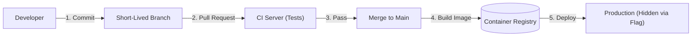

# CI/CD: Trunk-Based Development

## 1. The GitFlow Anti-Pattern in Modern CI/CD
GitFlow relies on long-lived branches (`develop`, `release`, `feature/*`). 
- **The Problem**: Long-lived branches lead to massive merge conflicts. "Merge Hell" delays releases, making Continuous Integration impossible because code is only integrated weeks after it's written.

## 2. Trunk-Based Development (TBD)
In TBD, all developers merge their code into a single central branch (usually `main` or `trunk`) multiple times a day.
- **Short-Lived Feature Branches**: Branches exist for a maximum of 2 days.
- **Continuous Integration**: Every push to `main` triggers automated unit and integration tests.
- **Feature Flags (Toggles)**: Since incomplete features are merged to production, they are hidden behind feature flags. The code is deployed, but the user cannot access it until the flag is flipped.

## 3. The CI/CD Pipeline Flow

