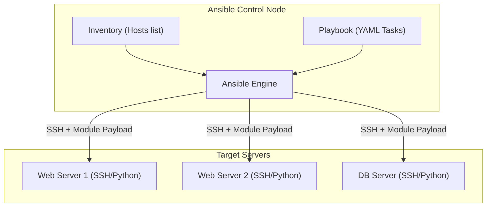

# Ansible Configuration Management

## Core Concepts

Ansible is an open-source automation tool for configuration management, application deployment, and task automation.

### 1. Agentless Architecture
Unlike Chef or Puppet, Ansible requires NO agents installed on target nodes. It relies purely on SSH (Linux) or WinRM (Windows) and Python to execute modules.

### 2. Inventories & Playbooks
- **Inventory:** A file (static or dynamic) defining the target servers, grouped by role (e.g., `[webservers]`, `[dbservers]`).
- **Playbook (YAML):** The instruction manual. Playbooks consist of "Plays", which map groups of hosts to a list of "Tasks".
- **Idempotency:** A core Ansible principle. Running a playbook 10 times should yield the same result as running it once. Modules only apply changes if the actual state differs from the desired state.

### Execution Map

