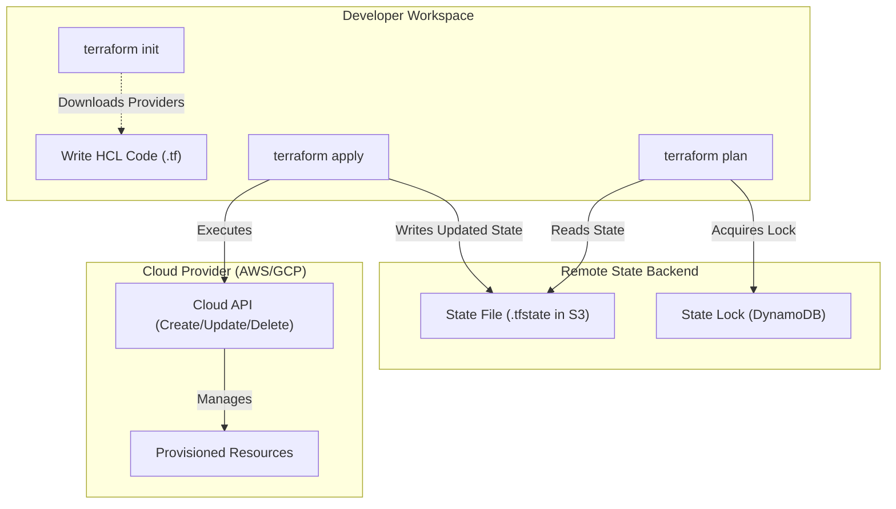

# Terraform IaC Patterns

## Core Concepts

Terraform is a declarative tool for provisioning infrastructure. Instead of writing scripts to create servers, you define the desired state, and Terraform executes the API calls to make reality match the state.

### 1. State Management (`.tfstate`)
Terraform maps real-world resources to your configuration using a state file. For teams, state MUST be stored remotely (e.g., AWS S3, Terraform Cloud) to avoid conflicts and loss.
- **State Locking:** Use DynamoDB tables alongside S3 to "lock" the state file, preventing two developers from running `terraform apply` simultaneously and corrupting infrastructure.

### 2. Modules (DRY Principle)
Encapsulate complex resource combinations (VPC + Subnets + NatGateway) into reusable modules. Consume modules using variables.

### Terraform Lifecycle Map

