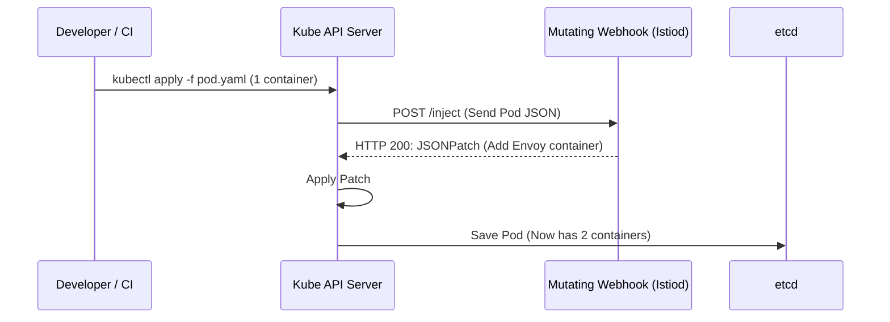

# Kubernetes Patterns: Sidecar Injection

## 1. The Sidecar Container
A Kubernetes Pod can run more than one container. The Sidecar pattern deploys a secondary helper container alongside the main application container within the same Pod.

Since containers in the same Pod share the same Network Namespace (localhost) and IPC namespace, the sidecar can augment the main app without modifying its code.
- **Envoy Proxy**: Handles mTLS, retries, and circuit breaking for the Service Mesh.
- **Fluentd/Filebeat**: Reads logs written to stdout or shared volumes and ships them to Elasticsearch.
- **Vault Agent**: Fetches secrets and writes them to a shared memory volume.

## 2. Automated Mutating Injection
Expecting developers to manually copy-paste the Envoy proxy YAML into every one of their deployments is an anti-pattern. Instead, Kubernetes intercepts the Pod creation request and automatically injects the sidecar on the fly.

This is achieved using a **MutatingAdmissionWebhook**.

### The Injection Flow

## 3. The Lifecycle Problem
A major historical flaw in Kubernetes was Sidecar lifecycle management. 
- **Startup Order**: If the Envoy sidecar takes 3 seconds to boot, but the main app boots in 1 second and immediately tries to make an outbound HTTP call, it will fail because Envoy hasn't established the network routes yet.
- **Shutdown Order (Jobs)**: If a CronJob finishes its work successfully, the main container exits. However, the sidecar (e.g., Fluentd) keeps running indefinitely. Kubernetes thinks the Job is still running, leaving the Job hanging forever.

### The Solution: Native Sidecar Containers (KEP-753)
Starting in Kubernetes v1.28, a native Sidecar feature was introduced. By setting `restartPolicy: Always` on an init container, it becomes a true Sidecar.
- Kubernetes guarantees the sidecar is fully ready *before* starting the main container.
- When the main container terminates, Kubernetes automatically issues a `SIGTERM` to the sidecars, solving the hanging Job problem elegantly.
